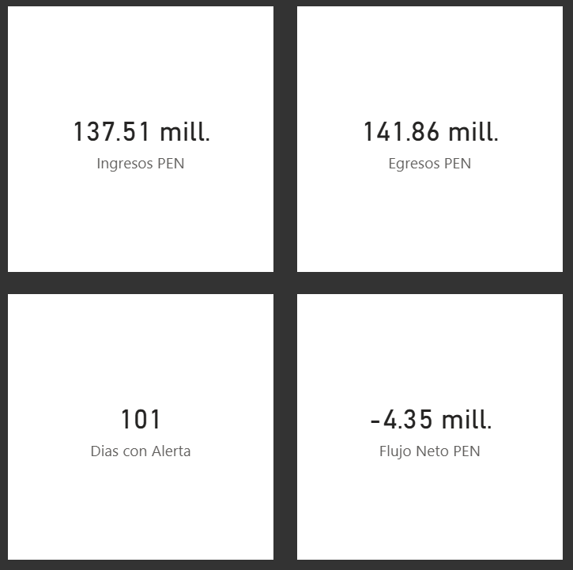
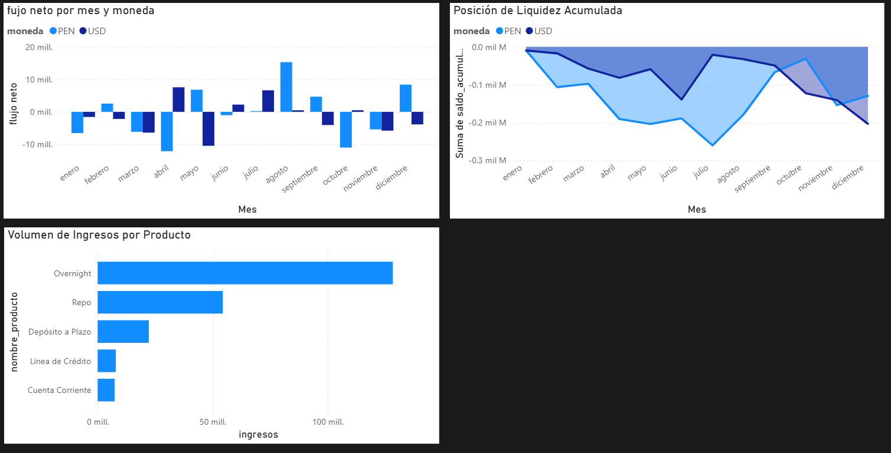
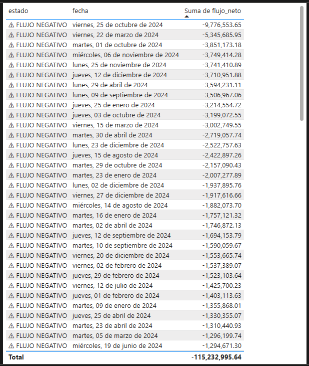

# Automatización de Reportes Operativos de Tesorería

Proyecto de análisis y automatización orientado a procesos de tesorería bancaria.  
Simula el flujo de información operativa de un área de tesorería y automatiza la generación de reportes que normalmente se elaboran de forma manual en Excel.

---

## Problema que resuelve

En tesorería, los analistas consolidan diariamente movimientos de múltiples productos (depósitos, overnights, repos, etc.) para calcular la posición de liquidez. Este proceso manual puede tomar varios minutos por reporte. Este proyecto lo automatiza a menos de 1 segundo.

---

## Herramientas utilizadas

| Herramienta | Uso |
|---|---|
| **PostgreSQL** | Base de datos relacional, almacenamiento de movimientos |
| **SQL** | Consultas con JOINs, agregaciones, window functions, alertas |
| **Python (pandas)** | Limpieza, procesamiento de datos y generación de reportes |
| **Power BI** | Dashboard interactivo con KPIs de liquidez |
| **openpyxl** | Exportación automatizada a Excel multi-hoja |

---

## Estructura del proyecto

```
tesoreria/
├── data/
│   └── generar_datos.py       # Genera el dataset simulado
├── sql/
│   └── consultas_tesoreria.sql
├── python/
│   └── reporte_tesoreria.py
├── screenshots/
│   ├── kpis.png
│   ├── dashboard_principal.png
│   └── alertas_liquidez.png
└── README.md

---

## Modelo de datos

**Tabla `movimientos`**
| Campo | Tipo | Descripción |
|---|---|---|
| id_movimiento | INT | Identificador único |
| fecha | DATE | Fecha del movimiento (días hábiles) |
| producto_id | INT | FK → productos |
| tipo_operacion | VARCHAR | `ingreso` / `egreso` |
| monto | NUMERIC(15,2) | Importe de la operación |
| moneda | VARCHAR | `PEN` / `USD` |
| contraparte | VARCHAR | Banco o cliente |

**Tabla `productos`**
| producto_id | nombre_producto |
|---|---|
| 1 | Depósito a Plazo |
| 2 | Overnight |
| 3 | Cuenta Corriente |
| 4 | Repo |
| 5 | Línea de Crédito |

---

## Consultas SQL implementadas

1. **Flujo neto diario** por fecha y moneda
2. **Posición de liquidez acumulada** usando window function `SUM() OVER`
3. **Análisis por producto** con JOIN y ticket promedio
4. **Top 5 contrapartes** por volumen operado
5. **Resumen semanal** con `DATE_TRUNC`
6. **Alertas de liquidez** — días con flujo PEN negativo

---

## Script de automatización Python

El script `reporte_tesoreria.py` realiza:

1. **Carga** de CSVs con validación de tipos
2. **Limpieza**: elimina duplicados, nulos y estandariza texto
3. **Cálculo de KPIs**:
   - Flujo neto diario (PEN y USD)
   - Saldo de liquidez acumulado
   - Resumen por producto financiero
   - Top 10 contrapartes por volumen
   - Alertas de días con flujo negativo
   - Resumen mensual
4. **Exportación** a Excel con 6 hojas temáticas
5. **Resumen ejecutivo** en consola

### Resultado en consola
```
=======================================================
  RESUMEN EJECUTIVO DE TESORERÍA
  Período: 2024-01-01 → 2024-12-31
=======================================================
  Total operaciones  :   500
  Días operativos    :   226

  [PEN] Ingresos     : S/     137,510,988.01
  [PEN] Egresos      : S/     141,859,423.78
  [PEN] Flujo neto   : S/      -4,348,435.77

  [USD] Ingresos     : $       82,918,029.44
  [USD] Egresos      : $       99,861,934.27
  [USD] Flujo neto   : $      -16,943,904.83

  Alertas liquidez   : 101 día(s) con flujo PEN negativo
=======================================================
  ⏱ Tiempo de ejecución: 0.80 segundos
```

---

## Cómo ejecutar

```bash
# 1. Clonar el repositorio
git clone https://github.com/tuusuario/tesoreria-bi

# 2. Instalar dependencias
pip install pandas openpyxl

# 3. Generar el dataset
cd data
python generar_datos.py

# 4. Ejecutar el reporte
cd ../python
python reporte_tesoreria.py
```

Para cargar los datos en PostgreSQL:
```sql
-- Crear tablas (indicado en consultas_tesoreria.sql)
-- Luego importar pgAdmin
COPY productos FROM 'productos.csv' CSV HEADER;
COPY movimientos FROM 'movimientos.csv' CSV HEADER;
```

---

## Dashboard Power BI

El dashboard incluye:
- **Flujo neto mensual** — gráfico barras agrupadas por moneda
- **Posición de liquidez acumulada** — área apilada
- **Distribución por producto** — gráfico de barras
- **KPIs principales** — tarjetas con total ingresos, egresos y flujo neto
- **Alertas** — tabla de días críticos con flujo negativo
- **Filtros** — por moneda, producto y rango de fechas

### KPIs Principales


Déficit de liquidez de S/ 4.35M en PEN durante 2024, con 101 días de flujo negativo.

### Flujo, Liquidez y Productos


Overnight concentra el mayor volumen de ingresos. La posición acumulada muestra deterioro sostenido desde marzo.

### Alertas de Liquidez


Top 31 días críticos ordenados por severidad. El día más crítico registró un flujo negativo de S/ 9.77M.

---

## Autor

**Sebastian Garate**  
Estudiante de Ingeniería de Sistemas — Universidad de Lima (7° ciclo)  
[LinkedIn](https://linkedin.com/in/sebastián-gárate-651698317) · [GitHub](https://github.com/SebGarate)
